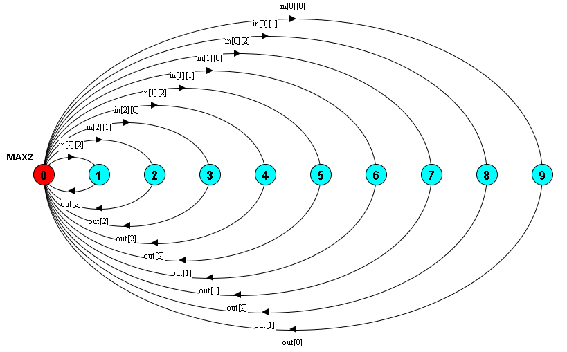
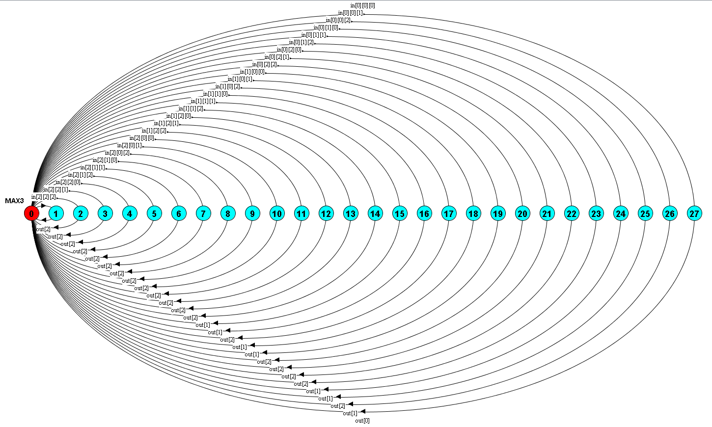

# Homework #7

##### by Xuenan Xu GWID G26980825
&nbsp;

**1**
```
MAX2 = (in[a:0..2][b:0..2] -> (when(a >=b) out[a] -> MAX2 | when(b > a) out[b] -> MAX2)).
```


**2**
```
MAX3 = (in[a:0..2][b:0..2][c:0..2] -> (when(a >=b) out[a] -> MAX3 | when(b >= a & b>= c) out[b] -> MAX3 | when(c >= a & c>= b) out[c] -> MAX3)).
```


&nbsp;
> Written with [Atom](https://atom.io/).
