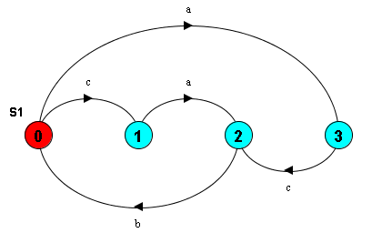
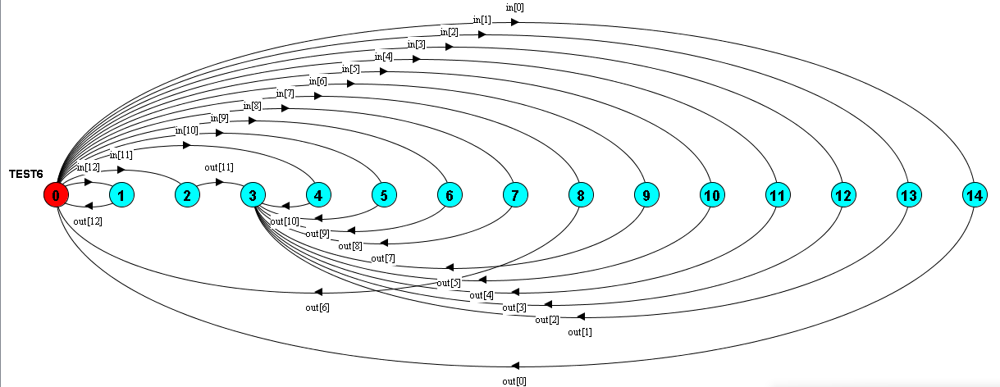

# Homework #8

##### by Xuenan Xu GWID G26980825
&nbsp;

**1**
```
S2 = (a->c->MID | c->a->MID),
MID = (b->S2).
```


**2**
```
EVEN = (in[x:0..12] -> (when (x % 2 == 0) out[x] ->EVEN | when (x % 2 != 0) out[x] -> STOP)).
TRIPLE = (in[x:0..12] -> (when (x % 3 == 0) out[x] ->TRIPLE | when (x % 3 != 0) out[x] -> STOP)).
||TEST6 = (EVEN || TRIPLE).
```


&nbsp;
> Written with [Atom](https://atom.io/).
